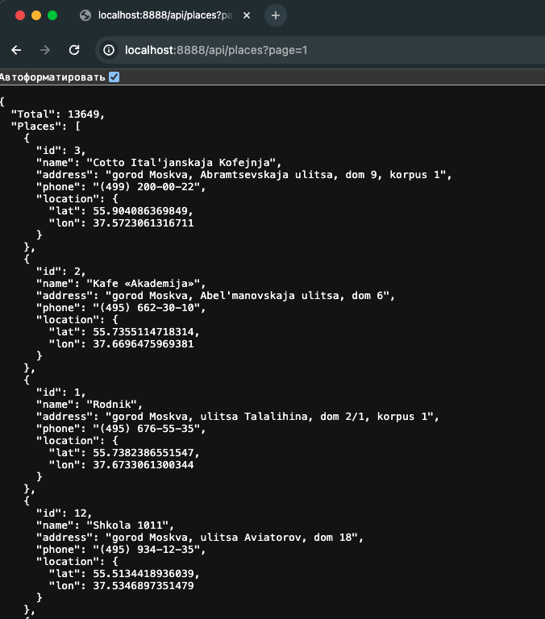
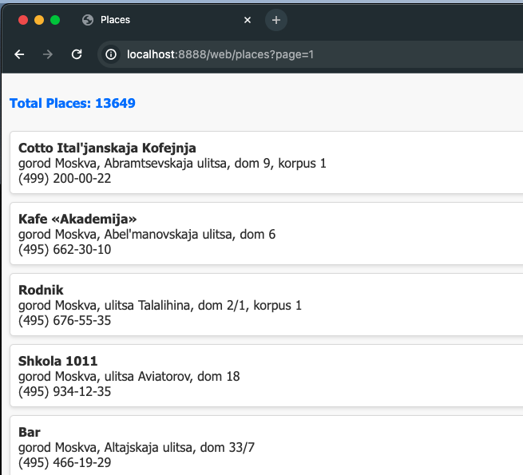
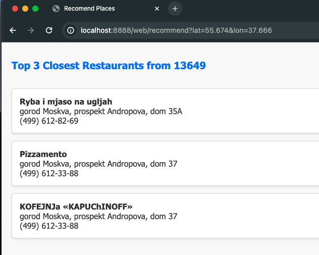
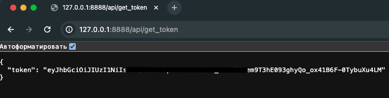
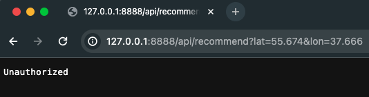

### Загрузка данных с использованием Elasticsearch

В настоящее время существует множество различных баз данных. Однако, для обеспечения возможности поиска вещей, мы решили воспользоваться Elasticsearch.

Elasticsearch - это поисковый движок полнотекстового поиска, построенный на основе Lucene. Он предоставляет HTTP API, который мы будем использовать в данной задаче.

Наш набор данных о ресторанах в Москве, Россия, включает в себя более 13 тысяч ресторанов и состоит из следующих полей для каждой записи:

- ID
- Название
- Адрес
- Телефон
- Долгота
- Широта
Прежде чем загружать все записи в базу данных, необходимо создать индекс и отображение, явно указав типы данных. Это важно, поскольку Elasticsearch иногда не распознает геоточки, если типы данных не указаны явно.

Для создания индекса и отображения использовали следующие ссылки:
https://www.elastic.co/guide/en/elasticsearch/reference/8.4/indices-create-index.html
https://www.elastic.co/guide/en/elasticsearch/reference/8.4/geo-point.html

После индексации все наши рестораны доступны для работы

## Простейший интерфейс

Cоздадли простейший  HTML-интерфейс для нашей базы данных с помощью пакета "html/template". Мы будем отображать страницу со списком названий, адресов и телефонов ресторанов для удобства пользователей.

В нашем HTTP-приложении будем использовать интерфейс Store, чтобы получать список ресторанов и предоставлять простую пагинацию. 

## Ближайшие рестораны

Реализуем основную функциональность - поиск трех ближайших ресторанов! Для этого настроили сортировку для запроса.
Таким образом, по URL-адресу http://127.0.0.1:8888/web/recommend?lat=55.674&lon=37.666б где "lat" и "lon" - это наши текущие координаты, мы получаем топ 3 самых близких ресторанов к нашему местоположению. 

## JWT

Последнее (но не менее важное) что мы сделали - это предоставили простую форму аутентификации. В настоящее время одним из самых популярных способов ее реализации для API является использование JWT. В Go есть довольно хороший набор инструментов для работы с ним.

Во-первых, мы реализовали API-конечную точку http://127.0.0.1:8888/api/get_token, единственная цель которой генерация токена и его возвращение.

Во-вторых, мы защитили нашу конечную точку /api/recommend с помощью промежуточного ПО JWT, которое будет проверять действительность этого токена.

Таким образом, по умолчанию при запросе этого API из браузера мы получаем отказ с HTTP 401 ошибкой.

Но все работает, когда клиент указывает заголовок Authorization: Bearer <token>  используя cURL.

